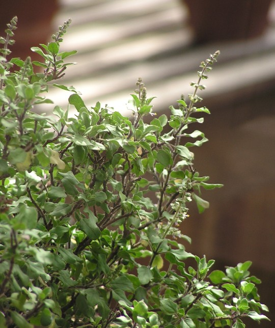
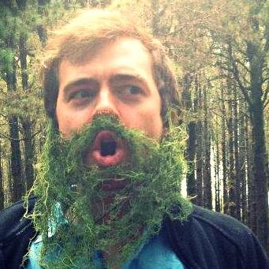

# OVERVIEW of ContentMining Workshop

A 1-day hands-on workshop to explore how new knowledge in Plant Sciences can be rapidly extracted from the scientific literature.

## Overview
The literature contains millions of articles and reports with detailed knowledge about plants. You will 
 * search EuropePMC which contains Open Access articles.
 * download them automatically (`getpapers` from ContentMine).
 * transform them into semantic form (`AMI` from ContentMine)
 * search them with multiple dictionaries (created from `Wikipedia`)
 * analyze the results (`AMI`)
 
## Style
All activities are hands-on. Some is online, but the much of the work is on your own machine. We have created a copy (memory stick) of the software, documentation, dictionaries and corpora so you can do most of the tasks offline. Everything is also is on http://github.com/petermr/tigr2ess.

The morning will have formal presentations with delegates "click-along" ("karaoke-style"), with pauses for questions and feedback. We'll  use the example of "Holy Basil" (*Ocimum tenuiflorum*) as it links to many fields (cooking, medicine, religion, and plant science). 

In the afternoon most delegates will form small free-form groups:
* multidisciplinary ("what can I learn about my plant?" - pests, climate, stress, invasive)
* hackathon style - small groups collaborating to create knowledge
* informal communication (Etherpad);
* dictionary-based

### Support staff
Team:
* Ambarish Kumar (NIPGR)
* Gitanjali Yadav (NIPGR-Cambridge)
* Peter Murray-Rust (Cambridge-ContentMine)
* Vinita Lamba (NIPGR)

Ambarish, Amit Yadav and Vinita have all worked very hard to make this workshop work.

### Thanks

Rik Smith-Unna  (ex Plant Sciences Cambridge) wrote `getpapers`.

## [Program](PROGRAM.md)

### morning
These are the modules with owners 
* **installation and housekeeping**. A brief review of any technical issues and re-programming. (Peter, Amit, Ambarish)
* **Searching EuropePMC** (online) (Vinita)
* **download papers** (online). Might be staggered due to bandwidth at either end. (Ambarish)
* **Wikipedia, Wikidata, WikiFactMine** (online) PeterMR will present these resources online, with complete instructions for self-paced work later. (Peter, Vinita)
* **creating dictionaries** (online). Wikipedia pages will be used to generate dictionaries for searching. (Ambarish)
* **searching with dictionaries** (local). A wide variety of Wiki-enhanced dictionaries will be used to search local corpora. (Amit)

### afternoon
Using the model of *Ocimum* choose your own plant (e.g. Millet, Rice, Wheat) to do a free-form project and report back. Partial resources for all these are supplied. 

(Optionally some delegates may wish to re-run the *Ocimum* material privately or explore the technology.) All material is licensed CC BY or Apache 2 and can be used without permission for any purpose (teaching, research, software, as long as attributed).

## directories 
[List of directories/resources](resources.md) in `tigr2ess` distribution and at http://github.com/petermr/tigr2ess. We shall refer to these throught the day. The definitive version will always be Github. Read the following to find where the resources are.

[ContentMine Directories in tigr2ess](DIRECTORIES.md).

