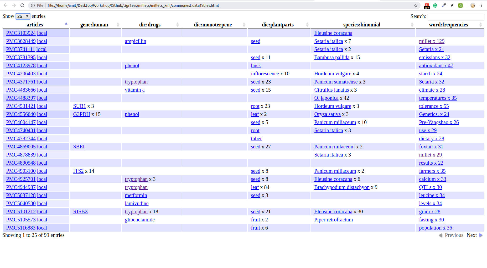

# ami analysis for Millet

Using `getpapers`, we retrieved 100 papers for millets in xml format, and stored them in `millets_xml` directory.

## ami-search-cooccur (on default ami dictionaries)
We issue the command `ami-search-cooccur` to run search and co-occurence on `millets_xml` project with the dictionaries for `species`, `gene`, `plantparts`, `drugs` and `monoterpene`. The exact command entered at the terminal is:
```
ami-search-cooccur millets_xml/ species gene plantparts drugs monoterpene
```

**TIME**: The above took around ~45seconds

The output on the terminal is huge. The above command creats a number of files inside the `millets_xml` directory. We are going to explore some of them. Let's begin with `commonest.dataTabales.html`.

### commonest.dataTables.html
The file looks as below:



The first column of the table contains PMC id's for the papers. The columns represent the dictionares. Each cell in the table contains the most common term present in a paper for a particular dictionary, and for some dictionaries the count for the commonest term is also prsent. 

Let's try to answer a few questions based on the above table:

Ques1. Which is the most prevelant `species` present in the papers?   
Ans1.  Since the millet group contains a number of different species, we can't reach to the conclusion regarding maximum studied species based only on visual inspection of the above table. But still we can see that `Setaria` genus is quite prevelant. 

Ques2.  Which are the most commonly studied parts of the plant?   
Ans2.  Here, we can see that `seed` and `root` are the most studied.

### __cooccurence/binomial-binomial/cooccur.svg
Ques1. Which two different species are most correlated i.e which two species terms occur together maximum number of times in our set of papers ?   
Ans1. `Panicum miliace` and `Setaria Italica`. 


