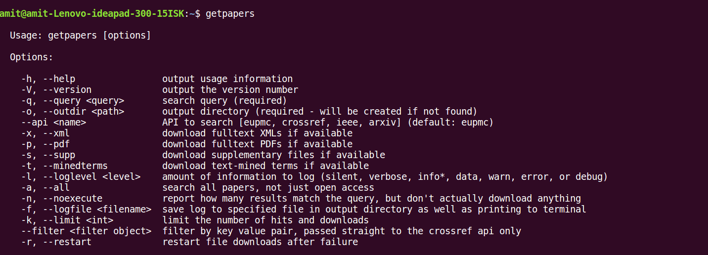

## INSTALLATION of `getpapers`

Please follow the below steps for installing `getpapers`.

### Step1: installing `nvm`

Open a terminal and run this command:

```bash
curl -o- https://raw.githubusercontent.com/creationix/nvm/v0.30.1/install.sh | bash
```

If it fails because you don't have `curl` installed, try using `wget` instead:

```bash
wget -qO- https://raw.githubusercontent.com/creationix/nvm/v0.30.1/install.sh | bash
```

Follow the instructions that appear in the terminal - it will ask you to close the terminal once it's done.

### Step2: installing `node`

After you've closed and re-opened your terminal, please run the below three commands.

```bash
nvm install 7
nvm use 7
nvm alias default 7
```

### Step3: installing `node` tool

Run the following command at the terminal.
```bash
npm install --global getpapers
```

Now enter `getpapers` at the terminal, and you should see something as following:




## INSTALLATION of `ami`

Please follow the below steps for installing `ami`.

#### Step1: JAVA

Please check that you have java8(same as java version 1.8) installed on your system by running the command `java -version` at the command prompt. It should look as following:


It is important that above you get java version 1.8, and not java version 1.7 or any earlier version. 
If you don't have java version 1.8, please dowload it from this link https://www.java.com/en/download/.

#### Step2: Set path

Please follow this step after you have got the `ami` software in the pendrive. This step will be updated.
