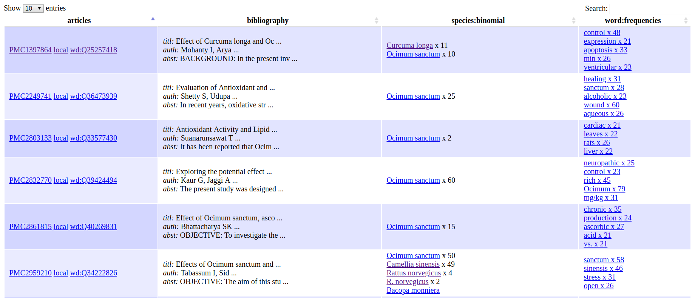
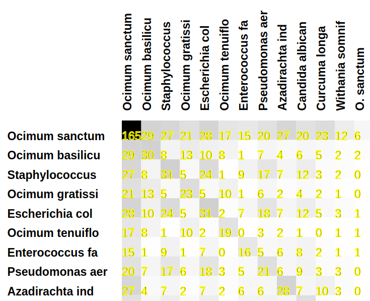
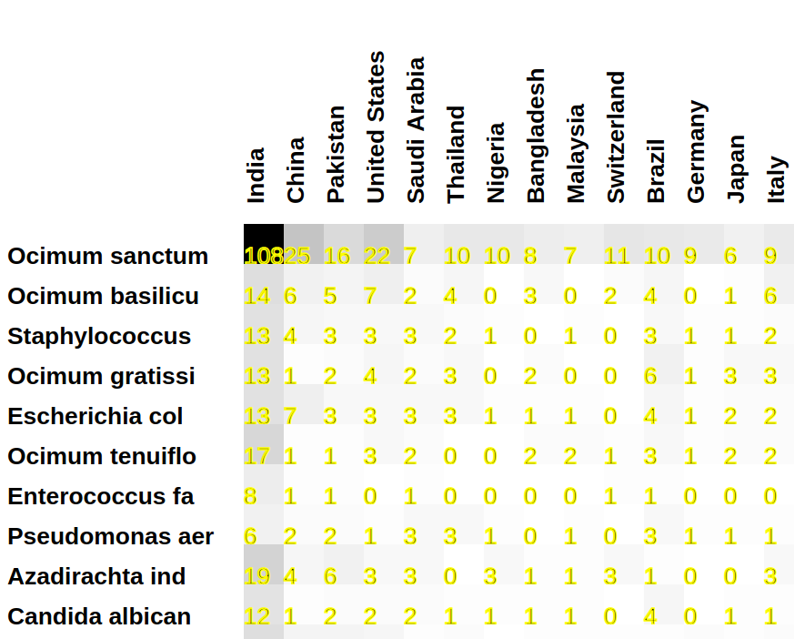

## Purpose of Tutorial

ami-search analysis

## Resources and software required

osanctum200 directory (it contains 200 papers related to osanctum), `ami-search-new`

## Instructions

*NOTE*: Specify current working directory for issuing below commands.

### COMMAND1
- Issue the following command (or copy-paste):
`ami-search-new -p ./ami20190219b/osanctum200/ --dictionary species`  
*Expected Time*: 2min  
*Output*:  
```
--------------------------
cProject: osanctum200

running: word; word([frequencies])[{xpath:@count>20}, {w.stopwords:pmcstop.txt stopwords.txt}]............................................................
running: species; species([binomial])[]SP: ./ami20190219b/osanctum200............................................................
create data tables
rrrrrrrrrrrrrrrrrrrrrrrrrrrrrrrrrrrrrrrrrrrrrrrrrrrrrrrrrrrrrrrrrrrrrrrrrrrrrrrr

```
- Open `full.dataTables.html` in a web-browser. It looks following: 

  

### COMMAND2
- Issue the following command (or copy-paste):    
`ami-search-new -p ./ami20190219b/osanctum200/ --dictionary plantparts`    
*Expected Time*: 1.5min  
*Output*:  
```

cProject: osanctum200

running: word; word([frequencies])[{xpath:@count>20}, {w.stopwords:pmcstop.txt stopwords.txt}]............................................................
running: search; search([plantparts])[]............................................................
create data tables
rrrrrrrrrrrrrrrrrrrrrrrrrrrrrrrrrrrrrrrrrrrrrrrrrrrrrrrrrrrrrrrrrrrrrrrrrrrrrrrr

```
- Open `full.dataTables.html` in a web-browser. It looks following:  
 
  

### COMMAND3
- Issue the following command (or copy-paste):  
`ami-search-new -p ./ami20190219b/osanctum200/ --dictionary country`  
*Expected Time*: 1.5min  
*Output*:  
```

cProject: osanctum200

running: word; word([frequencies])[{xpath:@count>20}, {w.stopwords:pmcstop.txt stopwords.txt}]............................................................
running: search; search([country])[]............................................................
create data tables
rrrrrrrrrrrrrrrrrrrrrrrrrrrrrrrrrrrrrrrrrrrrrrrrrrrrrrrrrrrrrrrrrrrrrrrrrrrrrrrr

```
- Open `full.dataTables.html` in a web-browser. It looks following: 
 


### COOCCURENCE INTERPRETATION

- Go to `__cooccurrence` directory, then to `binomial-binomial` directory. Inside it, open `cooccur.svg` in a web-browser.




### COMMAND4

- Issue the following command:  
`ami-search-new -p ./ami20190219b/osanctum200/ --dictionary species country`  
*Expected Time*: 2.5min  
*Output*:  
```

cProject: osanctum200

running: word; word([frequencies])[{xpath:@count>20}, {w.stopwords:pmcstop.txt stopwords.txt}]............................................................
running: species; species([binomial])[]SP: ./ami20190219b/osanctum200............................................................
running: search; search([country])[]............................................................
create data tables
rrrrrrrrrrrrrrrrrrrrrrrrrrrrrrrrrrrrrrrrrrrrrrrrrrrrrrrrrrrrrrrrrrrrrrrrrrrrrrrr
```

- Go to `__cooccurrence` directory, then to `binomial-binomial` directory. Inside it, open `cooccur.svg` in a web-browser.  



*Interpretation*: `Ocimum Sanctum` occurs maximum with country `India`, followed by `China`. 


