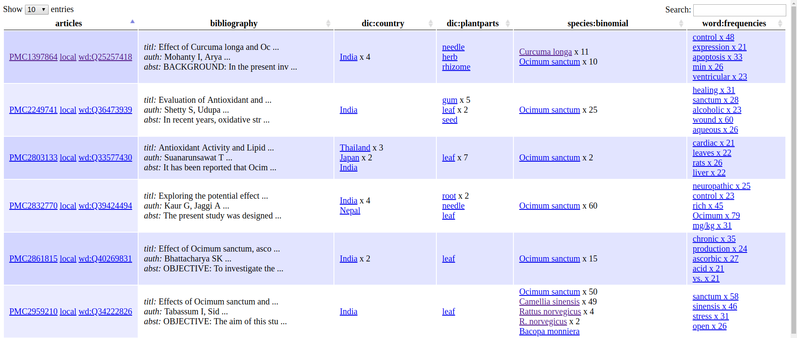

# SEARCH with AMISearch and dictionaries

## Purpose of Tutorial

To search and analyse a local corpus of scientific publications using `AMISearch` and local dictionaries.

## Resources and software required

* `osanctum200` directory (200 papers related to *Ocimum sanctum* ).
* `ami-search-new` software including builtin dictionaries.
* local ContentMine format dictionaries created by previous `ami-dictionary` or pre-loaded.

## Instructions
### Ocimum corpus
You should start with a corpus of 200 XML articles for *Ocimum sanctum*. You should have created this under the [getpapers](../getpapers/) tutorial but if not there is a corpus here called `ocimum200`. We have also created a copy of this [ocimum](./ocimum) which you can recopy to `ocimum200` if anything goes wrong.


Work in the current `tigr2ess` directory. This will *modify* your `osanctum200` files.
```
cd <myworkspace>/tigr2ess
```
check this contains `osanctum200`.

### backup (only if required)
```
cd <myworkspace>/tigr2ess
cp -R ocimum/ ocimum200/
```

## workflow steps

* Start with the `country` dictionary which is bundled in the software. This is a simple lookup against Wikipedia's list of countries.
* Then use `species` which is a syntax-driven search.
* Then use a local dictionary (`ocimum`) for personal search.


### COMMAND1 Country

* The "country" dictionary is bundled in the software and is a simple lookup against Wikipedia's list of countries. 

- Issue the following command:
---
```
ami-search-new -p osanctum200/ --dictionary country
```
---
---

### explanation of command
* `osanctum200` is the `CProject` containing the 200 papers from `getpapers`. It contains 200 `CTree`s such as 
```
├── PMC1397864
│   ├── eupmc_result.json
│   ├── fulltext.xml
├── PMC2249741
│   ├── eupmc_result.json
│   ├── fulltext.xml
```
The search needs to be done on HTML files so the first time `ami-search` is called it will silently transform XML to HTML (`scholarly.html`). Therefore the first `ami-search` will take more time.
```
.
├── PMC1397864
│   ├── eupmc_result.json
│   ├── fulltext.xml
│   ├── scholarly.html
    .
├── PMC2249741
│   ├── eupmc_result.json
│   ├── fulltext.xml
│   ├── scholarly.html
    .
├── PMC2803133
│   ├── eupmc_result.json
│   ├── fulltext.xml
│   ├── scholarly.html
    .
	.
```

The dictionary is a `builtin` dictionary and included in `ami`. 

### expected output
*Expected Time*: 2min  
```
--------------------------
cProject: osanctum200

running: word; word([frequencies])[{xpath:@count>20}, {w.stopwords:pmcstop.txt stopwords.txt}]............................................................
running: species; species([binomial])[]SP: ./ami20190219b/osanctum200............................................................
create data tables
rrrrrrrrrrrrrrrrrrrrrrrrrrrrrrrrrrrrrrrrrrrrrrrrrrrrrrrrrrrrrrrrrrrrrrrrrrrrrrrr

```
The `.` etc. are indicators that the search is progressing. Large files (> 50 pp) are slow and searches (especially `species`)  are truncated. 

### fullDataTables.html
This is the most important output (ignore most other files). It's a rectangular table whose *columns* are the searches and the *rows* are the papers.

- Open `full.dataTables.html` in a web-browser. It looks following: 

  

### COMMAND2
- Issue the following command (or copy-paste):    
`ami-search-new -p ./ami20190219b/osanctum200/ --dictionary plantparts`    
*Expected Time*: 1.5min  
*Output*:  
```

cProject: osanctum200

running: word; word([frequencies])[{xpath:@count>20}, {w.stopwords:pmcstop.txt stopwords.txt}]............................................................
running: search; search([plantparts])[]............................................................
create data tables
rrrrrrrrrrrrrrrrrrrrrrrrrrrrrrrrrrrrrrrrrrrrrrrrrrrrrrrrrrrrrrrrrrrrrrrrrrrrrrrr

```
- Open `full.dataTables.html` in a web-browser. It looks following:  
 
  

### COMMAND3
- Issue the following command (or copy-paste):  
`ami-search-new -p ./ami20190219b/osanctum200/ --dictionary country`  
*Expected Time*: 1.5min  
*Output*:  
```

cProject: osanctum200

running: word; word([frequencies])[{xpath:@count>20}, {w.stopwords:pmcstop.txt stopwords.txt}]............................................................
running: search; search([country])[]............................................................
create data tables
rrrrrrrrrrrrrrrrrrrrrrrrrrrrrrrrrrrrrrrrrrrrrrrrrrrrrrrrrrrrrrrrrrrrrrrrrrrrrrrr

```
- Open `full.dataTables.html` in a web-browser. It looks following: 
 


### COOCCURENCE INTERPRETATION

- Go to `__cooccurrence` directory, then to `binomial-binomial` directory. Inside it, open `cooccur.svg` in a web-browser.


### COMMAND4

- Issue the following command:  
`ami-search-new -p ./ami20190219b/osanctum200/ --dictionary species country`  
*Expected Time*: 2.5min  
*Output*:  
```

cProject: osanctum200

running: word; word([frequencies])[{xpath:@count>20}, {w.stopwords:pmcstop.txt stopwords.txt}]............................................................
running: species; species([binomial])[]SP: ./ami20190219b/osanctum200............................................................
running: search; search([country])[]............................................................
create data tables
rrrrrrrrrrrrrrrrrrrrrrrrrrrrrrrrrrrrrrrrrrrrrrrrrrrrrrrrrrrrrrrrrrrrrrrrrrrrrrrr
```

- Go to `__cooccurrence` directory, then to `binomial-binomial` directory. Inside it, open `cooccur.svg` in a web-browser.  


*Interpretation*: `Ocimum Sanctum` occurs maximum with country `India`, followed by `China`. 


